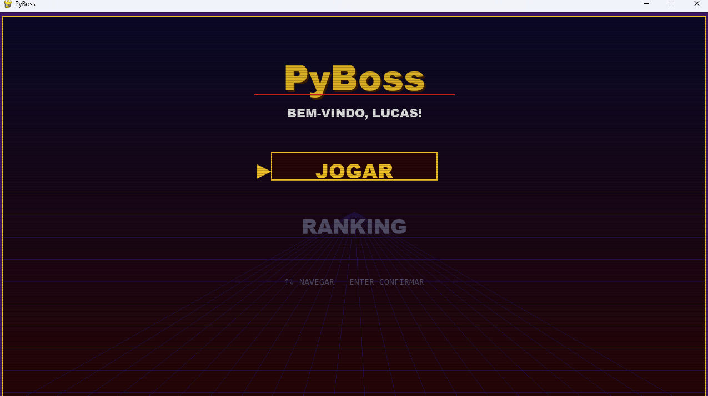
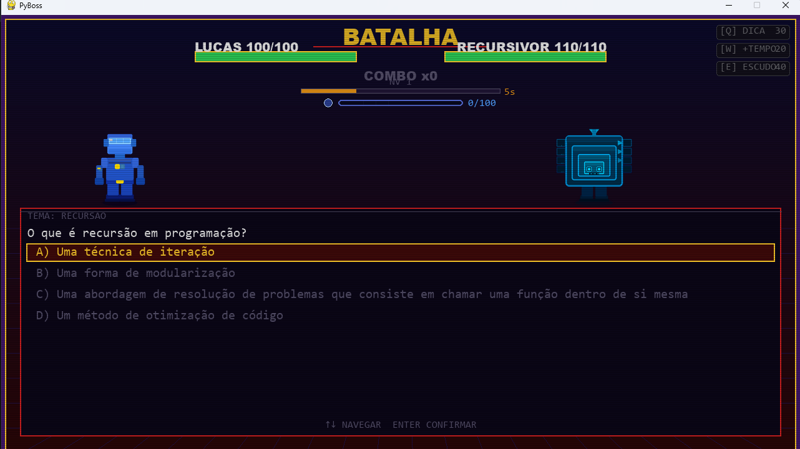
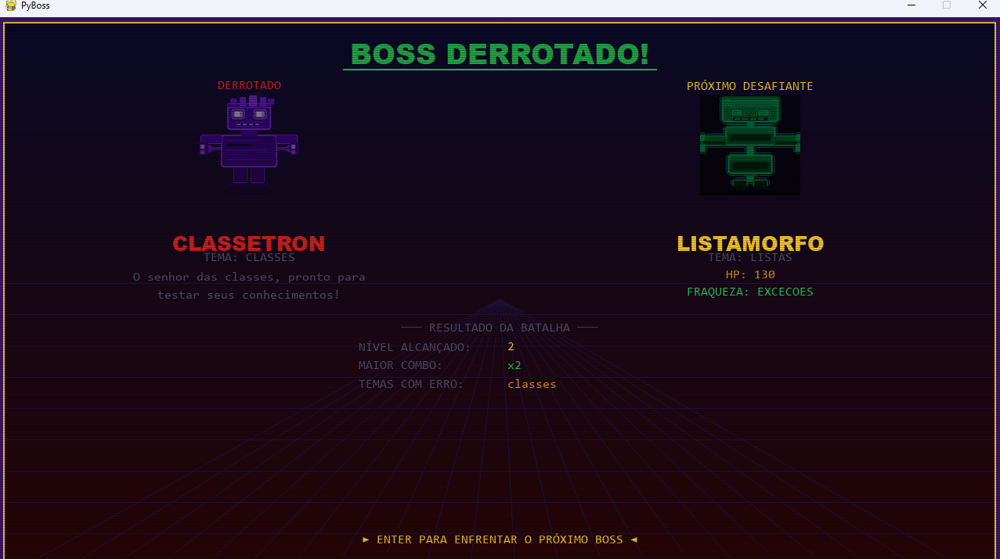
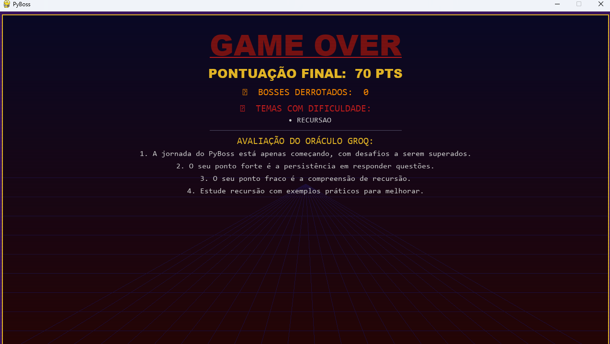
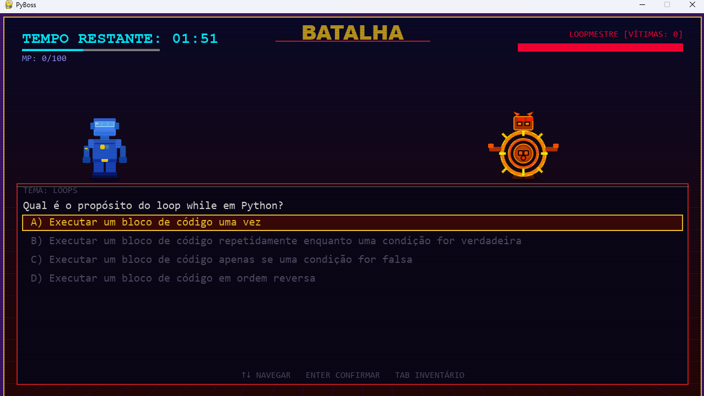
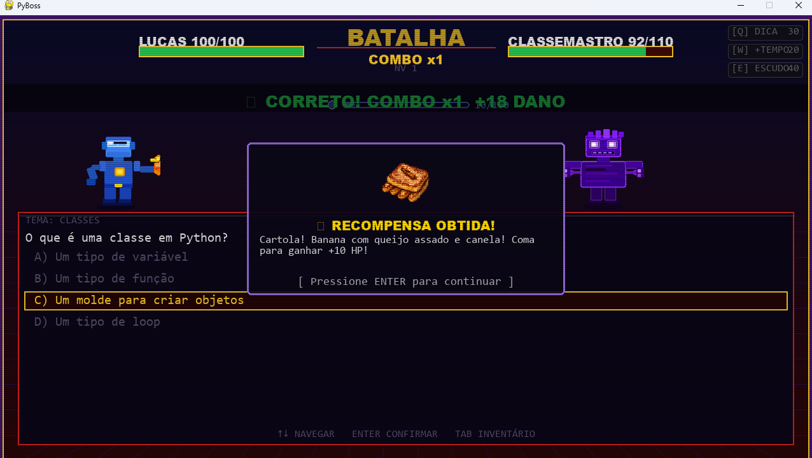
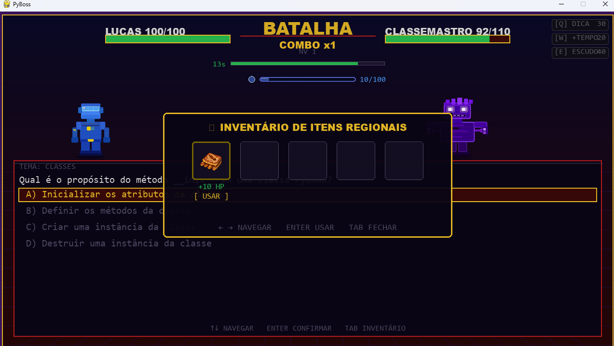

# ⚔️ PyBoss


> **Aprenda Python derrotando chefes gerados por Inteligência Artificial.**
>
> Um RPG educativo onde cada batalha é uma oportunidade de aprender, evoluir e descobrir seus pontos fortes e fracos na linguagem Python.

---

# 📸 Screenshots

## Menu Principal


## Batalha Contra um Boss


## Tela de Transição


## Relatório Inteligente


## Modo Arcade


## Sistema de Drops


## Inventário de Itens


# 🎯 Sobre o Jogo

PyBoss é um jogo educativo desenvolvido com **Python** e **Pygame** que transforma o aprendizado da linguagem em uma experiência de RPG.

O jogador enfrenta uma sequência de bosses temáticos, respondendo perguntas sobre Python para causar dano e avançar de nível.

Diferente de jogos tradicionais de perguntas e respostas, PyBoss utiliza **Inteligência Artificial** para gerar conteúdo dinâmico durante a partida.

Cada run é única.

A IA cria:

- Perguntas
- Alternativas
- Bosses
- Descrições
- Relatórios de desempenho

Tudo em tempo real.

---

# 🚀 Por que PyBoss?

Existem muitos cursos de Python.

Existem muitos jogos de perguntas.

PyBoss combina os dois.

O objetivo não é apenas testar conhecimento, mas ensinar.

Ao longo da partida o jogador aprende através de:

- Progressão gradual de dificuldade
- Feedback imediato
- Repetição inteligente de conceitos
- Relatórios personalizados
- Aprendizado baseado nos erros cometidos

---

# 🤖 Inteligência Artificial

PyBoss utiliza a API da **Groq** com o modelo **LLaMA 3.3 70B** para gerar dinamicamente o conteúdo do jogo.

A IA é responsável por:

- Criar bosses únicos
- Gerar perguntas contextualizadas
- Adaptar a dificuldade ao progresso do jogador
- Evitar repetição de questões durante a mesma run
- Produzir relatórios de aprendizado após a derrota

Isso garante uma experiência diferente a cada partida.

---

# 🧠 Aprendizado Adaptativo

O sistema acompanha o desempenho do jogador durante toda a run.

Conforme o jogador evolui:

- A dificuldade das perguntas aumenta
- Novos conceitos são introduzidos
- Os desafios tornam-se mais específicos
- O conteúdo acompanha o nível alcançado

O resultado é uma curva de aprendizado mais natural e envolvente.

---

# ⚔️ Sistema de Combate

O combate é baseado em perguntas de múltipla escolha.

## Acertar

✅ Causa dano ao boss

✅ Aumenta o combo

✅ Aproxima o jogador da próxima batalha

## Errar

❌ Quebra o combo

❌ Causa dano ao herói

❌ Aproxima o fim da run

---

# 🔥 Sistema de Combo

Acertos consecutivos aumentam o multiplicador de dano.

Quanto maior o combo:

- Mais dano causado
- Maior pontuação
- Maior recompensa pela precisão

---

# 👾 Bosses Dinâmicos

Os bosses não possuem características fixas.

A IA gera:

- Nome
- Descrição
- Tema
- Vida
- Características narrativas

Os temas atualmente incluem:

- Listas
- Loops
- Classes e OOP
- Exceções
- Recursão
- Dicionários

Exemplos de bosses gerados:

| Boss | Tema |
|--------|--------|
| LISTUS MAXIMUS | Listas |
| LOOPUS INFINITUS | Loops |
| CLASSICUS REX | Classes |
| EXCEPTIO FATALIS | Exceções |
| RECURSIVUS | Recursão |
| DICTATOR SUPREMUS | Dicionários |

---

# 📊 Relatório Inteligente

Ao final de cada run, o Oráculo Groq analisa seu desempenho.

O relatório identifica:

- Temas com maior índice de erro
- Conceitos problemáticos
- Assuntos que precisam de reforço

Exemplo:

> Você apresentou maior dificuldade em questões relacionadas a Listas e Dicionários.
>
> Recomenda-se revisar:
>
> - Métodos de listas
> - List Comprehensions
> - Manipulação de dicionários
> - Iteração com `for`

O objetivo é transformar cada derrota em uma oportunidade de aprendizado.

---

# 🏆 Ranking Local

PyBoss possui um ranking persistente armazenado em SQLite.

São registrados:

- Nome do jogador
- Pontuação
- Nível alcançado
- Data da partida

Isso permite acompanhar sua evolução e disputar as melhores posições.

---

# 🎮 Controles

| Tecla | Ação |
| ------- | -------- |
| ↑ / ↓ | Navegar entre alternativas na batalha |
| ENTER | Confirmar resposta |
| ESPAÇO | Confirmar resposta ou uso de item |
| TAB | Abrir ou fechar o inventário |
| ← / → | Navegar pelos itens do inventário |
| R | Retornar ao menu após a derrota |

---

# 📂 Estrutura do Projeto

```text
PyBoss/
├── client/
│   ├── main.py
│   │
│   ├── engine/
│   │   ├── combat.py
│   │   ├── entities.py
│   │   ├── utils.py
│   │   └── config.py
│   │
│   ├── viewer/
│   │   ├── base.py
│   │   ├── tela_nome.py
│   │   ├── tela_menu.py
│   │   ├── tela_batalha.py
│   │   ├── tela_transicao.py
│   │   ├── tela_game_over.py
│   │   └── tela_rank.py
│   │
│   ├── network/
│   │   └── ai_service.py
│   │
│   └── backend/
│       └── database.py
│
└── assets/
    └── sprites/
```

---

# 🛠️ Tecnologias Utilizadas

- Python 3.11+
- Pygame
- SQLite
- Groq API
- LLaMA 3.3 70B

---

# 🚀 Instalação

## 1. Clone o repositório

```bash
git clone https://github.com/seu-usuario/pyboss.git
cd pyboss
```

## 2. Crie um ambiente virtual

### Linux/macOS

```bash
python -m venv .venv
source .venv/bin/activate
```

### Windows

```powershell
python -m venv .venv
.venv\Scripts\activate
```

## 3. Instale as dependências

```bash
pip install -r requirements.txt
```

## 4. Configure a chave da API

Crie o arquivo:

```python
client/engine/config.py
```

E adicione:

```python
GROQ_API_KEY = "sua-chave-aqui"
```

## 5. Execute o jogo

```bash
python client/main.py
```

---

# 📋 Dependências

```text
pygame
groq
```

SQLite utiliza apenas a biblioteca padrão do Python.

---

# ⚙️ Configurações

Em `combat.py` é possível ajustar parâmetros como:

```python
TEMPO_RESPOSTA = 15.0
DANO_BASE_HEROI = 12
DANO_BASE_BOSS = 10
TIMER_APRESENTACAO = 3.0
```

---

# 🎓 Público-Alvo

PyBoss foi criado para:

- Iniciantes em Python
- Estudantes de programação
- Autodidatas
- Professores
- Pessoas que preferem aprender através da prática

---

# Relatório 

Davi Gomes:

https://docs.google.com/document/d/1G9rIZBDOUr5qKOxBlUi7RTlVNrHB8mSNWeCs6BNneoU/edit?usp=drivesdk

Lucas Augusto:

https://docs.google.com/document/d/1JzRC_RFp1SfL7hLKvyMu6KoPY5HReUdtbVpHYiMYkKM/edit?tab=t.0


